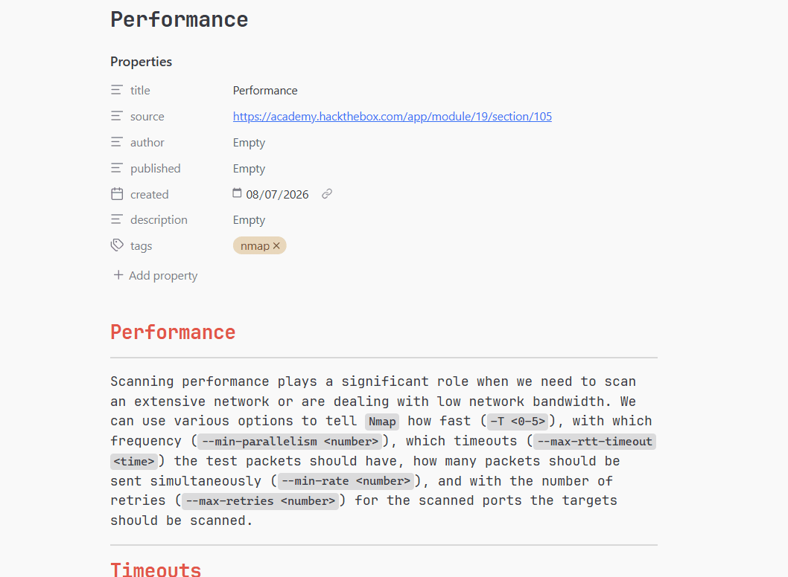
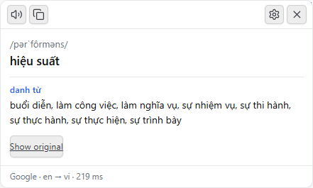
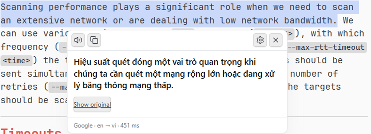

# Selection Translate

Select any text in Obsidian and translate it in place — in notes, in PDFs, in properties, in reading view and while editing. Single words also get their pronunciation, part of speech and alternative meanings.

*[Tiếng Việt](README.vi.md)*



| Single word | Sentence |
|---|---|
|  |  |

## Features

- **Works everywhere text does.** Reading view, Live Preview, Source mode, PDF pages, properties (both names and values), tables, callouts, code blocks, links and popout windows.
- **A button, not an interruption.** Selecting text shows a small button beside it. It moves out of the way of menus, tooltips and the PDF toolbar rather than covering them, and it stays with the text as you scroll.
- **Ten languages, either way.** English, Vietnamese, both Chinese scripts, Japanese, Arabic, Spanish, Italian, French and German all work as a source and as a target, plus Russian as a source.
- **Dictionary detail for single words.** Pronunciation, part of speech and alternative meanings, not just a one-line translation.
- **Three engines.** Google without a key, Google Cloud Translation, or DeepL. The right server for a DeepL key is chosen from the key itself.
- **Read aloud.** Through your system voice, offline, or through Google.
- **Reads Markdown as a reader would.** Selecting `**Domain** [information](https://example.com)` sends `Domain information`, not the syntax and the URL.
- **Vietnamese and English interface**, following Obsidian's own language by default.
- **Nothing stored, nothing tracked.** No telemetry of any kind, and translations are never written to disk.

## Installation

### From the community plugins list

Settings → Community plugins → Browse → search for **Selection Translate** → Install → Enable.

### From a release

1. Download `main.js`, `manifest.json` and `styles.css` from the [latest release](https://github.com/sonthicse/obsidian-selection-translate/releases/latest).
2. Put them in `<vault>/.obsidian/plugins/selection-translate/`.
3. Settings → Community plugins → turn off Restricted mode → enable **Selection Translate**.

### Beta versions through BRAT

Install [BRAT](https://github.com/TfTHacker/obsidian42-brat), then *Add beta plugin* with `sonthicse/obsidian-selection-translate`.

Full instructions, including building from source, are in [docs/INSTALL.md](docs/INSTALL.md) (Vietnamese).

## Usage

1. Select some text. A small button appears beside it.
2. Click it, or press the hotkey you bound to *Translate selection*.
3. The popup shows the translation, and for a single word its pronunciation and meanings.

Other ways in:

- **Double-click a word** to translate it immediately (turn on *Translate on double click*).
- **Translate on selection** skips the button entirely (turn on *Translate as soon as text is selected*).
- **The command palette** has *Selection Translate: Translate selection*, which you can bind to a hotkey in Settings → Hotkeys. No hotkey is assigned by default.

The button and the popup are anchored to the text you selected, not to the
screen. Scrolling carries them along; scroll the selection out of view and they
go with it, scroll back and they return where they were.

Close the popup with Escape, by clicking elsewhere, or with its close button.

Pick your engine in the options: **DeepL** and **Google Cloud** are documented APIs and take a key; the default is Google's undocumented endpoint, which takes none. What each one costs you, and what it does not promise, is set out under [Network use](#network-use).

## Network use

This plugin contacts the following hosts. **Nothing is sent unless you actively select text and ask for a translation**, and the only thing sent is that selected text.

| Host | When | What is sent | Why |
|---|---|---|---|
| `translate.googleapis.com` | Only when the engine is **Google (no key)** — the default | The selected text, the source and target language codes | Translation, and the dictionary data for single words |
| `api-free.deepl.com` | Only when the engine is **DeepL** and your key ends in `:fx` | The selected text, language codes, your DeepL API key | Translation |
| `api.deepl.com` | Only when the engine is **DeepL** and your key does not end in `:fx` | The selected text, language codes, your DeepL API key | Translation |
| `translation.googleapis.com` | Only when the engine is **Google Cloud** | The selected text, language codes, your Google Cloud API key | Translation |
| `api.dictionaryapi.dev` | Only when *Look up single words* is on, the word is English, and Google supplied no pronunciation | The single selected word | Pronunciation and definitions |
| `translate.google.com` | Only when you press read aloud **and** the voice is set to **Google** | The selected text | Speech audio |

Not sent, ever: file names, file paths, vault contents beyond the selection, note metadata, your settings, or any identifier.

**There is no telemetry, analytics, crash reporting or usage tracking in this plugin.**

The system voice (the default for reading aloud) uses your operating system's speech synthesiser and sends nothing anywhere.

`translate.googleapis.com` and `translate.google.com` are **endpoints Google does not document or support**. They are the ones the Google Translate browser extension uses. They can change or stop working without notice, and using them is not covered by any published terms of service — so whether that use is appropriate is a judgement you are making for yourself, not one this plugin has made on your behalf. Google makes no commitment about how it handles what is sent there either.

They are the default because they need no account. If you would rather use a supported service, choose **DeepL** or **Google Cloud** in the options — both are documented APIs with published terms, and switching is one dropdown away. If you work with sensitive material, or under any compliance obligation, switch.

Details, and how to switch every one of these off, are in [docs/PRIVACY.md](docs/PRIVACY.md) (Vietnamese).

## About your API keys

DeepL and Google Cloud keys are stored **as plain text** in:

```
<vault>/.obsidian/plugins/selection-translate/data.json
```

This is where Obsidian keeps plugin settings; no plugin can store a secret any better. What follows from it:

- **Do not commit that file** if your vault is in Git. Add `.obsidian/plugins/selection-translate/data.json` to `.gitignore`.
- **Consider excluding it from sync.** Obsidian Sync, Dropbox, iCloud and OneDrive will otherwise copy the key to every device and to the provider's servers.
- Anyone with access to your vault files has your key. Treat a synced vault as a place a key lives.

The key is never logged, never included in an error message, and never sent anywhere except to the service that issued it. The input field is masked so it does not appear in screenshots or screen recordings.

If a key is exposed, revoke it: [DeepL account page](https://www.deepl.com/your-account/keys), [Google Cloud credentials](https://console.cloud.google.com/apis/credentials).

Step-by-step instructions for obtaining a key are in [docs/API-SETUP.md](docs/API-SETUP.md) (Vietnamese).

## Known limitations

- **The free Google engine is unofficial.** It can break at any time. If the dictionary section stops appearing, that is usually why; the translation itself degrades gracefully and keeps working. Switch to DeepL or Google Cloud for a supported service.
- **DeepL returns no dictionary data.** No API tier of DeepL provides pronunciation or parts of speech. With DeepL selected, that information is fetched separately, from Google or the Free Dictionary API, if *Look up single words* is on.
- **PDF selection is fragile on some Obsidian builds.** Obsidian 1.9 has a defect where a PDF selection can register as empty. The plugin reads the highlighted text layer directly to recover it. If that misbehaves, turn off *Recover PDF selections*.
- **Reading aloud needs a voice installed.** The system voice depends on your operating system, and many Linux installs ship none. You will be told plainly rather than left with silence. The Google voice needs no installed voice but sends the text to Google.
- **Google's read-aloud is chunked.** Its endpoint refuses anything much over 200 characters, so long passages are split and played in sequence, with a brief gap between parts.
- **Requests time out after 15 seconds.** The underlying request cannot be cancelled, only abandoned, so a slow service produces an error with a retry button rather than a spinner that never stops.
- **The popup does not take focus** when it opens, so the highlight stays visible. Press Tab to move focus into it.

## Contributing

Bug reports and pull requests are welcome. See [docs/CONTRIBUTING.md](docs/CONTRIBUTING.md) (Vietnamese) for the development setup, and [docs/ARCHITECTURE.md](docs/ARCHITECTURE.md) for how the pieces fit together.

```bash
npm install
npm run dev      # watch build
npm run verify   # types, tests, lint and the Obsidian guideline checks
```

## Credits

- Built for [Obsidian](https://obsidian.md).
- Icons from [Lucide](https://lucide.dev), which Obsidian bundles.
- Pronunciation and definitions from the [Free Dictionary API](https://dictionaryapi.dev).
- Translation by [DeepL](https://www.deepl.com/pro-api) and [Google Translate](https://cloud.google.com/translate).

This project is not affiliated with, endorsed by, or connected to Obsidian, DeepL or Google.

## Licence

[MIT](LICENSE) © Thi Duong
