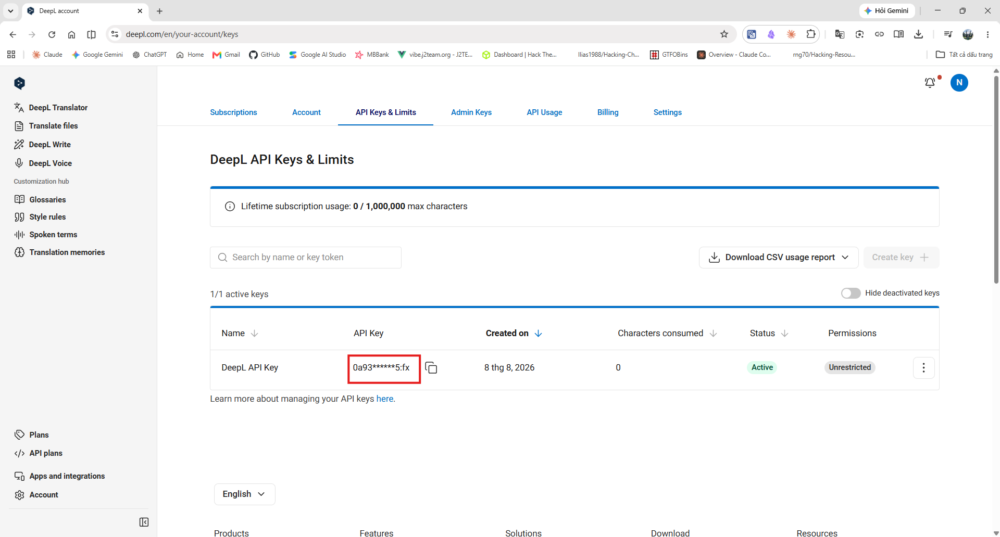
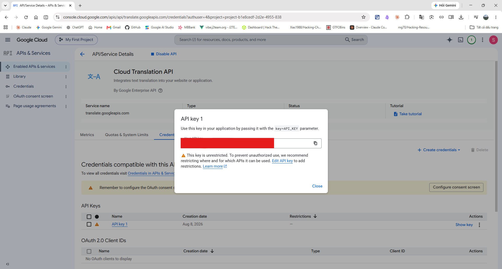

# Lấy khoá API

Plugin **chạy được ngay không cần khoá nào** — công cụ mặc định là Google (không cần khoá). Tài liệu này dành cho khi bạn muốn một dịch vụ chính thức, được hỗ trợ.

| | Google (không khoá) | DeepL API Free | Google Cloud |
|---|---|---|---|
| Cần tài khoản | Không | Có | Có |
| Cần thẻ ngân hàng | Không | Có (không bị trừ tiền) | Có (có bật thanh toán) |
| Hạn mức | Không công bố | 500.000 ký tự/tháng | Theo hạn mức Cloud |
| Có tài liệu chính thức | **Không** | Có | Có |
| Có dữ liệu từ điển | **Có** | Không | Không |

> Nếu bạn chỉ cần dịch và không muốn phụ thuộc vào một endpoint không chính thức, **DeepL API Free** là lựa chọn hợp lý nhất.

---

## 1. DeepL API Free

### Các bước

1. Mở <https://www.deepl.com/pro-api> và chọn gói **DeepL API Free**.
   > Chú ý chọn đúng **API Free**, không phải *DeepL Pro* (gói dịch cho người dùng cuối, **không** kèm khoá API).
2. Tạo tài khoản và xác minh email.
3. DeepL yêu cầu **thông tin thẻ để xác minh danh tính**. Gói Free **không bị tính phí**; thẻ chỉ dùng để chống lạm dụng. Nếu bạn không muốn cung cấp thẻ, hãy dùng Google Cloud hoặc giữ công cụ mặc định.
4. Vào **Account → API keys** (hoặc *Tài khoản → Khoá API*).
5. Bấm **Create key** rồi sao chép khoá.



> **Ảnh mẫu.** Thay `docs/images/deepl-key.png` bằng ảnh chụp thật.

### Hậu tố `:fx` nghĩa là gì

Khoá gói Free trông như:

```
a1b2c3d4-e5f6-7890-abcd-ef1234567890:fx
                                      ^^^
```

Ba ký tự cuối `:fx` cho biết đây là khoá **Free**, và khoá Free chỉ hoạt động với máy chủ `api-free.deepl.com`. Khoá Pro **không** có hậu tố này và dùng `api.deepl.com`.

Gửi nhầm máy chủ sẽ nhận **403 "Wrong endpoint"** — thông báo này nhìn y hệt lỗi khoá sai, và đó là lỗi tích hợp DeepL phổ biến nhất.

**Plugin tự chọn máy chủ đúng từ hậu tố của khoá.** Bạn không phải chọn gì cả. Chỉ cần dán **toàn bộ** khoá, kể cả phần `:fx`.

### Dán vào plugin

1. Settings → Community plugins → **Selection Translate**.
2. Mục **Công cụ dịch** → chọn **DeepL**.
3. Dán khoá vào ô **Khoá API DeepL**.
4. Bấm **Kiểm tra kết nối**.

Nếu đúng, bạn sẽ thấy số ký tự đã dùng trên tổng hạn mức, ví dụ `Kết nối được. Đã dùng 0 trên 500000 ký tự.`

> Nút kiểm tra gọi endpoint `/v2/usage` chứ không phải endpoint dịch, nên bấm bao nhiêu lần cũng **không tốn ký tự** nào trong hạn mức.

### Hạn mức 500.000 ký tự/tháng

Tính theo ký tự **gửi đi**, không phải ký tự nhận về. Để hình dung: một đoạn văn cỡ 500 ký tự thì hạn mức đủ cho khoảng **1.000 lần dịch mỗi tháng**.

Bộ nhớ đệm của plugin giúp tiết kiệm đáng kể: tra lại cùng một từ không gửi request mới. Tăng **Số bản dịch ghi nhớ** trong mục *Nâng cao* nếu bạn hay tra đi tra lại.

Khi hết hạn mức, DeepL trả mã `456` và plugin hiện thông báo kèm nút **Đổi công cụ dịch**.

---

## 2. Google Cloud Translation API

Nhiều bước hơn DeepL và **bắt buộc bật thanh toán**, kể cả khi bạn nằm trong hạn mức miễn phí.

### Các bước

1. Mở <https://console.cloud.google.com/> và đăng nhập.
2. **Tạo project**: menu chọn project ở đầu trang → *New project* → đặt tên → *Create*.
3. **Bật API**: vào <https://console.cloud.google.com/apis/library/translate.googleapis.com> → chọn đúng project → bấm **Enable**.
4. **Bật thanh toán**: *Billing* → *Link a billing account*. Google **bắt buộc** bước này để dùng Translation API.
5. **Tạo khoá**: *APIs & Services* → *Credentials* → *Create credentials* → **API key**.
6. Sao chép khoá (dạng `AIza...`).



> **Ảnh mẫu.** Thay `docs/images/google-cloud-key.png` bằng ảnh chụp thật.

### ⚠️ Giới hạn khoá — đừng bỏ qua bước này

Khoá API Google mới tạo **dùng được cho mọi API đã bật trong project**. Nếu khoá bị lộ, người khác có thể tiêu tiền của bạn qua bất kỳ dịch vụ nào trong project đó.

Ngay sau khi tạo khoá:

1. Ở trang *Credentials*, bấm vào tên khoá vừa tạo.
2. Mục **API restrictions** → chọn **Restrict key**.
3. Trong danh sách, chỉ tick **Cloud Translation API**.
4. **Save**.

Việc này biến một khoá "tiêu được tiền ở mọi nơi" thành khoá chỉ dịch được chữ. Nó không ngăn được việc lộ khoá, nhưng giới hạn hẳn thiệt hại.

Cân nhắc thêm:

- **Application restrictions**: để *None*, vì plugin gọi từ máy tính người dùng chứ không từ một domain hay IP cố định.
- **Đặt ngân sách cảnh báo**: *Billing → Budgets & alerts* → tạo ngân sách nhỏ (ví dụ 1 USD) để được email khi có chi tiêu bất thường.

### Dán vào plugin

1. Settings → **Selection Translate** → mục **Công cụ dịch**.
2. Chọn **Google Cloud**.
3. Dán khoá vào ô **Khoá API Google Cloud**.
4. Bấm **Kiểm tra kết nối**.

> Nút kiểm tra của Google Cloud **có** gửi một request dịch thật (từ `hello`), vì API này không có endpoint kiểm tra riêng. Chi phí là 5 ký tự.

---

## 3. Google miễn phí — không cần khoá

Đây là mặc định. Không cần tài khoản, không cần khoá, không cần thẻ. Nó cũng là công cụ **duy nhất** trả về dữ liệu từ điển (phiên âm, loại từ, các nghĩa khác) trong cùng một request.

### ⚠️ Cảnh báo cần đọc

Nó dùng `translate.googleapis.com/translate_a/single` — **endpoint mà Google không công bố cũng không hỗ trợ**. Đây chính là endpoint mà tiện ích Google Translate của trình duyệt dùng.

Điều đó có nghĩa là:

- **Google có thể đổi hoặc chặn nó bất cứ lúc nào**, không báo trước.
- **Không có điều khoản dịch vụ công bố nào cho phép sử dụng nó.** Nếu bạn đang dùng trong môi trường doanh nghiệp hoặc cần tuân thủ pháp lý, hãy chọn DeepL hoặc Google Cloud.
- **Không có cam kết hạn mức.** Tra quá nhiều trong thời gian ngắn có thể bị chặn tạm thời (mã `429`).

Plugin xử lý việc này bằng cách **phân tích phản hồi hoàn toàn phòng thủ**: nếu Google đổi định dạng, phần từ điển biến mất nhưng bản dịch vẫn chạy, thay vì plugin sập.

Bạn sẽ thấy cảnh báo này ngay trong tuỳ chọn khi chọn công cụ đó.

---

## 4. Free Dictionary API — phiên âm tiếng Anh

Không cần khoá, không cần cấu hình. Plugin gọi `api.dictionaryapi.dev` **chỉ khi** cả ba điều sau đúng:

1. Bật *Tra cứu từ đơn* (mặc định bật).
2. Vùng chọn là **một từ tiếng Anh**.
3. Google **không** trả về phiên âm cho từ đó.

Lý do nó tồn tại: endpoint Google miễn phí thường không trả phiên âm cho cặp Anh → Việt, mà đó lại là cặp phổ biến nhất của plugin này, và phiên âm IPA là thứ được mong đợi nhất trong popup.

Tắt bằng cách đặt **Nguồn từ điển** thành *Google* hoặc *Tắt*.

---

## Khắc phục sự cố

| Thông báo | Nguyên nhân thường gặp |
|---|---|
| *Khoá API bị từ chối* (DeepL) | Dán thiếu, hoặc thiếu phần `:fx` ở cuối. Dán lại toàn bộ khoá. |
| *Khoá API bị từ chối* (Cloud) | Chưa bật Cloud Translation API cho project, hoặc chưa bật thanh toán. |
| *Công cụ này đã hết hạn mức* | DeepL hết 500.000 ký tự tháng này, hoặc Cloud vượt hạn mức. Đổi công cụ hoặc đợi kỳ sau. |
| *Gửi quá nhiều yêu cầu liên tiếp* | Bị giới hạn tần suất. Đợi một lát. Nếu hay gặp với Google miễn phí, cân nhắc chuyển sang một API chính thức. |
| *Dịch vụ dịch không phản hồi kịp* | Quá 15 giây. Bấm **Thử lại**. |
| *Không kết nối được tới dịch vụ dịch* | Mất mạng, hoặc tường lửa/proxy chặn. |

Bật **Ghi log gỡ lỗi** trong mục *Nâng cao* để xem chi tiết trong console (`Ctrl+Shift+I`). Log **không bao giờ** chứa khoá API, và cũng không chứa nội dung bản dịch.
